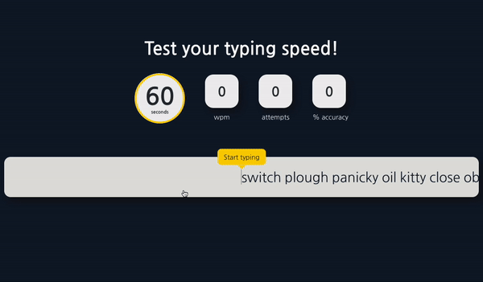

# Check you typing speed  🤓 💻

### This is a typing speed test app inspired by [LiveChat.com](https://www.livechat.com/typing-speed-test) built in React + Typescript. I really liked the approach they took and decided to recreate it.

# Demo



# Getting Started

 To get it up and running simply clone the repo and run the following commands

```bash
> npm i
> npm start
```

The app will start up and you can start typing 🚀

# Contributing

If you want to contribute to this project, please feel free to open an issue or pull request.

## Also feel free to make a copy of this app and change it however you want 🚀